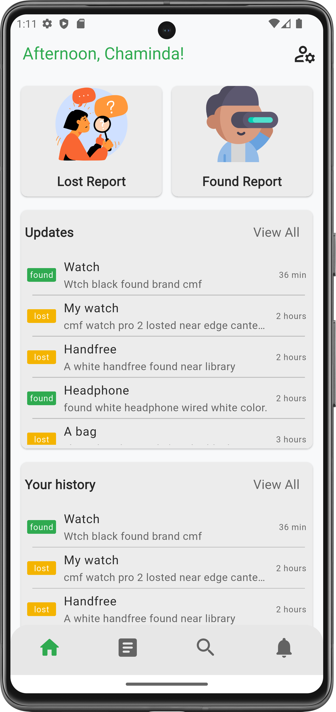

# NSBM FindX

---

## 🎯 About NSBM FindX

NSBM FindX is a mobile application specifically designed to help **students and staff at NSBM Green University** easily report and find lost items within the campus. Whether you've misplaced your keys, phone, or other personal belongings, NSBM FindX is here to streamline the process of reuniting you with your lost items.

Our goal is to create a more connected and supportive campus community by leveraging technology to solve everyday problems.

---

## ✨ Features

* **Report Lost Items:** Quickly and easily report lost items with essential details like category, detailed description, last known location, and date.
* **Browse Found Items:** View a comprehensive list of items found and reported by other members of the NSBM community.
* **Smart Matching (ML Integration):** Utilizes two Machine Learning models(Vision,Gemini) to intelligently match reported lost items with found items. The app employs Google's Vision AI and Gemini models to intelligently match items. They convert images and descriptions into vectors (numerical representations). By comparing these vectors, the system accurately finds highly similar lost and found items, significantly boosting recovery.
* **Real-time Notifications:** Get instant alerts when a potential match for your lost or found item is detected.
* **User Profiles:** Manage your reported items and notification preferences.

---

## 📸 Screenshots

Here's a glimpse of NSBM FindX in action:
Dark and light mode supported for a better user experience.

**1. Home (Student)**
<table>
  <tr>
    <td>
      
      <br>
      Light mode
    </td>
    <td>
      
      <br>
      Dark mode
    </td>
  </tr>
</table>
_Easily view recent updates about found and lost items._


**1. Dashboard (Admin/Staff)**
<table>
  <tr>
    <td>
      
      <br>
     Light mode
    </td>
    <td>
      
      <br>
      Dark mode
    </td>
  </tr>
</table>
_Easily view recent updates about found and lost items._

**4. Item Details / Match View**
<table>
  <tr>
    <td>
      
      <br>
     Light mode
    </td>
    <td>
      
      <br>
      Dark mode
    </td>
  </tr>
</table>
_View details of items and potential matches._

---

## 🚀 Getting Started

This project is a Flutter application. To get a copy up and running on your local machine for development and testing purposes, follow these steps.

### Prerequisites
* Flutter SDK installed (version 3.x.x recommended)
* Firebase CLI installed and configured
* Node.js and npm (for Cloud Functions)

### Installation
1.  **Clone the repository:**
    ```bash
    git clone [https://github.com/dushaDev/NSBMFindX.git](https://github.com/dushaDev/NSBMFindX.git)
    cd NSBMFindX
    ```

2.  **Install Flutter dependencies:**
    ```bash
    flutter pub get
    ```
### Running the App
1.  **Configure Firebase:**
    * Follow the official Firebase Flutter setup guide to connect your project to a Firebase project (iOS, Android, Web). This typically involves creating a `firebase_options.dart` file.
    * Deploy your Firebase Cloud Functions (if not already deployed).
2.  **Run on a device or emulator:**
    ```bash
    flutter run
    ```
---
## 🤝 Contributing
We welcome contributions! If you have suggestions for improvements or bug fixes, please feel free to:

1.  Fork the repository.
2.  Create your feature branch (`git checkout -b feature/your-branch`).
3.  Commit your changes (`git commit -m 'Add some Features'`).
4.  Push to the branch (`git push origin feature/your-branch`).
5.  Open a Pull Request.

---

## 📧 Contact

For any inquiries or feedback, feel free to reach out:

* **Email:** dushanmadushankabeligala9@gmail.com
* **GitHub:** dushaDev

---